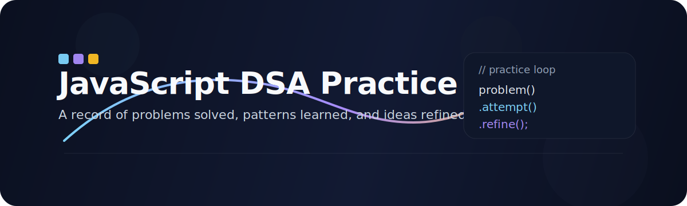
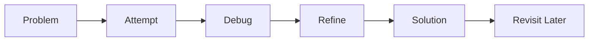

# JavaScript DSA Practice Journal

This repository is a running log of algorithm practice in JavaScript.
It is meant to track what I have solved, what I am still working through, and what I want to revisit later.

## At A Glance

| What it is | What it is not |
| --- | --- |
| A personal problem-solving journal | A finished showcase |
| A place to revisit patterns | A folder dump |
| A record of progress over time | A collection of isolated answers |

## How It Works

Each file is a checkpoint in that loop.
The goal is not only to arrive at a solution, but to understand the path that led there.

## Naming Pattern

Files follow this format:

`<problem-number>_<problem-name>.js`

That keeps the journey ordered and makes revision easier.

If a file name includes a `*`, it is a reminder that the solution should be revisited regularly.
It marks the problems I want to keep fresh, refine, and understand more deeply over time.

## What You Will Find Here

- JavaScript solutions to DSA problems
- pattern-based practice across core topics
- iterative improvements as ideas become clearer
- notes embedded in code where they help explain the thinking

## Why This Repository Exists

To build consistency.
To make revision easier.
To keep a visible record of growth.

It is a working archive, not a polished exhibit. The value is in the trail.
